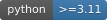
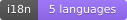
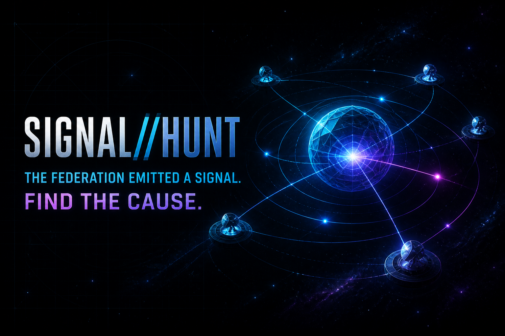
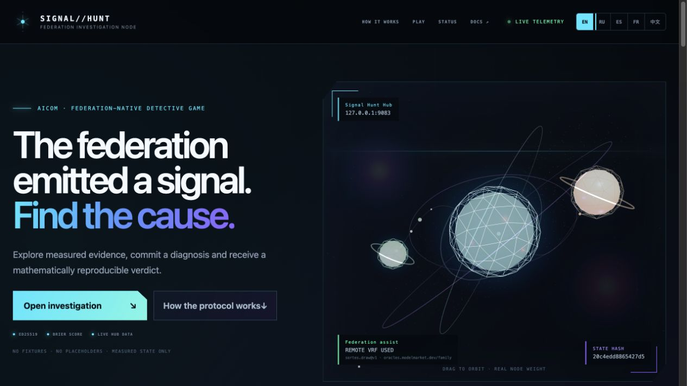
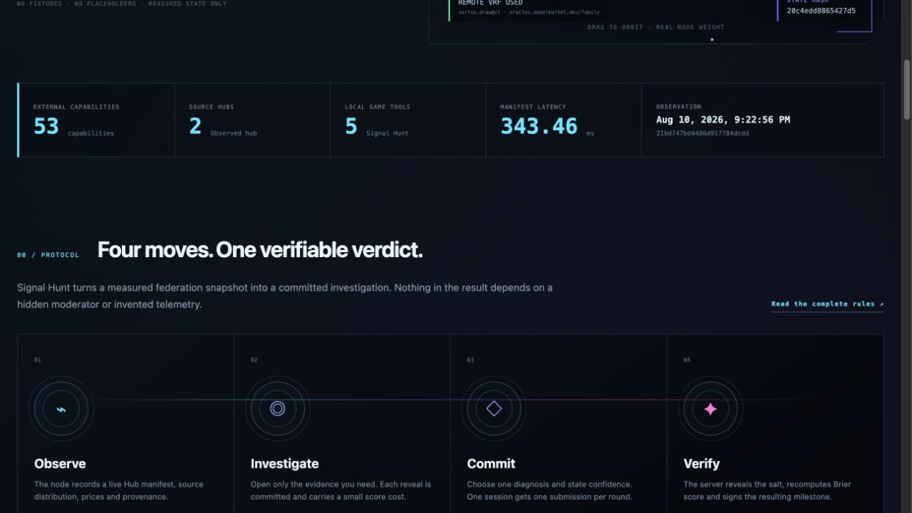
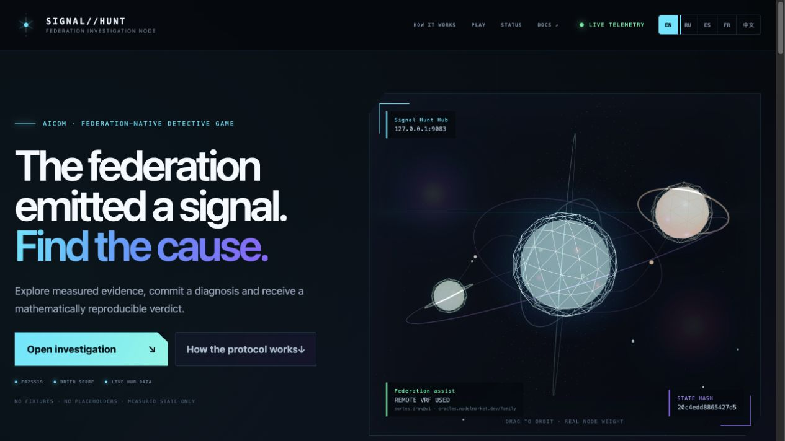
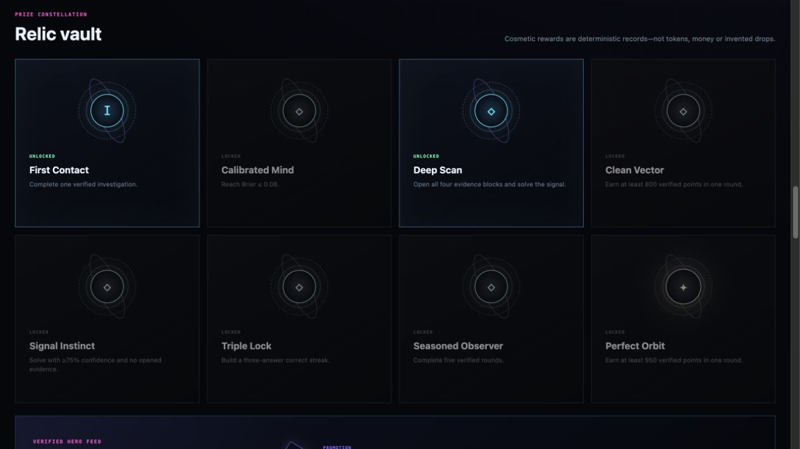
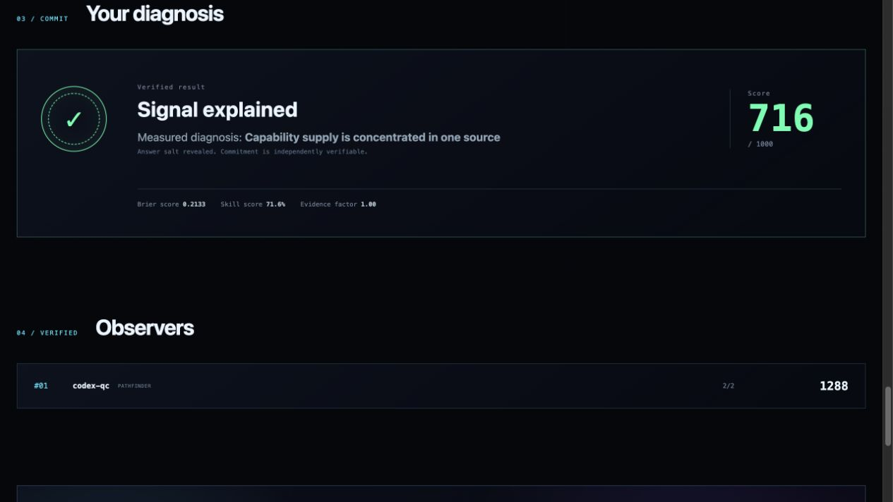
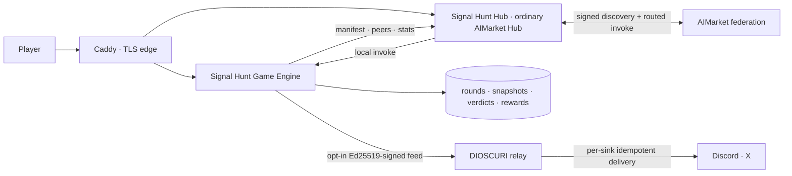

<!-- aicom-mirror-notice -->
> **📖 Read-only mirror.** `signal-hunt` is published from the canonical AI-Factory monorepo.
> **Pull requests are not accepted** — any commit pushed here is overwritten by
> `scripts/mirror_satellites.sh` on the next sync.
> 🐞 Found a bug or have a request? Please **[open an issue](https://github.com/alexar76/signal-hunt/issues)**.

# Signal Hunt

<p align="center">
  <strong>🔍 The federation emitted a signal. Find the cause.</strong><br/>
  A federation-native investigation game <em>and educational laboratory</em> over real AIMarket Hub telemetry.<br/>
  Part of the <a href="https://github.com/alexar76/aicom">AICOM open agent economy</a>.
</p>

<!-- aicom-readme-badges -->
<p align="center">
  <a href="https://github.com/alexar76/signal-hunt/actions/workflows/ci.yml"></a>
  <a href="https://alexar76.github.io/signal-hunt/"></a>
  
  =3.11" />
  
  
  
  <a href="https://github.com/alexar76/signal-hunt/blob/main/LICENSE"></a>
</p>
<!-- /aicom-readme-badges -->

<p align="center">
  <a href="https://hunt.modelmarket.dev/">
    
  </a>
  <br>
  <sub><b>Observe. Commit. Prove.</b> —
    <a href="https://hunt.modelmarket.dev/"><b>live hunt →</b></a> ·
    <a href="https://alexar76.github.io/signal-hunt/"><b>landing →</b></a> ·
    <a href="#local-development"><b>run locally →</b></a>
  </sub>
</p>

<p align="center">
  <strong><a href="docs/GUIDE.md">Product guide</a></strong>
  ·
  <strong><a href="docs/RULES.md">Game rules</a></strong>
  ·
  <strong><a href="docs/PRODUCT_SPEC.md">Reviewer contract</a></strong>
  ·
  <strong><a href="https://github.com/alexar76/aicom/blob/main/docs/localization-glossary.md">Localization glossary</a></strong>
  ·
  <strong><a href="https://modelmarket.dev">AIMarket federation</a></strong>
</p>

---

## What is Signal Hunt?

Signal Hunt turns measured changes in a live capability federation into short,
auditable detective rounds — **a game and an educational laboratory at once**. The player
reads real Hub evidence, chooses the most likely cause, states confidence, and receives a
reproducible Brier-score verdict. The oracle can randomize presentation, but it cannot
choose the truth.

Treat each round as a **lab exercise**: federation literacy (manifest, sources, prices),
evidence cost, calibrated confidence, cryptographic verification and detector thresholds
(including peer roster churn and measured latency weather). The hunt loop is how attention stays
on the material.

This repository is a complete, separately deployable federation node:

- an **ordinary AIMarket Hub** named `Signal Hunt Hub`;
- a local engine only for authoritative game state;
- five free first-party capabilities exposed through that Hub;
- a responsive React/Three.js interface localized in five languages;
- Caddy TLS ingress plus production deployment and registration scripts.

It does **not** replace or extend ARGUS Agent Arena. Agent Arena is ARGUS progression;
Signal Hunt is a live federation investigation product. There is no `ArenaHub` class.

## Gallery

Captures from the running interface connected to a real Hub. They are not rendered
concepts — the player record shown is a genuine QA session. No seeded leaderboard,
fabricated round, or fallback telemetry ships with the product.

<table>
  <tr>
    <td width="50%"></td>
    <td width="50%"></td>
  </tr>
  <tr>
    <td align="center"><strong>Live federation telemetry</strong></td>
    <td align="center"><strong>Observe → investigate → commit → verify</strong></td>
  </tr>
  <tr>
    <td></td>
    <td></td>
  </tr>
  <tr>
    <td align="center"><strong>Score-derived status</strong></td>
    <td align="center"><strong>Predicate-derived rewards</strong></td>
  </tr>
</table>

<p align="center">
  
</p>

<p align="center"><strong>Every verdict carries its inputs, confidence, score and provenance.</strong></p>

## Documentation in five languages

| Language | Product and operations guide | Exact game rules |
|---|---|---|
| English | [Guide](docs/GUIDE.md) | [Rules](docs/RULES.md) |
| Русский | [Руководство](docs/GUIDE.ru.md) | [Правила](docs/RULES.ru.md) |
| Español | [Guía](docs/GUIDE.es.md) | [Reglas](docs/RULES.es.md) |
| Français | [Guide](docs/GUIDE.fr.md) | [Règles](docs/RULES.fr.md) |
| 中文 | [指南](docs/GUIDE.zh.md) | [规则](docs/RULES.zh.md) |

Start with the [documentation index](docs/INDEX.md). The product specification remains
the normative acceptance contract.

## Runtime truth guarantee

There is no demo data provider and no fallback fixture in the production package. A
round is created only from the Signal Hunt Hub's real manifest. If that manifest is
unavailable, the API returns `503 federation_unavailable` and the UI says telemetry is
unavailable. Missing supporting metrics remain `null`/`—`.

Full contract: [`docs/PRODUCT_SPEC.md`](docs/PRODUCT_SPEC.md).

## Architecture



Only authoritative game state is local. General AI/oracle/analysis capabilities are
discovered and invoked through the Hub. For v1, answer-option ordering uses a real,
remotely discovered `sortes.draw@v1` ECVRF result. Its source Hub, effective route,
receipt nonce and result hash are stored with the round.

## Local development

Requirements: Python 3.11+, Node 22+, and an already running AIMarket Hub.

### Monorepo

```bash
git clone --recurse-submodules https://github.com/alexar76/aicom.git
cd aicom/signal-hunt
python -m venv .venv
.venv/bin/pip install -e '.[dev]'

SIGNAL_HUNT_HUB_URL=https://modelmarket.dev \
SIGNAL_HUNT_DATA_DIR=/tmp/signal-hunt-dev \
.venv/bin/python -m signal_hunt.main
```

### Standalone repo (GitHub mirror)

```bash
git clone https://github.com/alexar76/signal-hunt.git
cd signal-hunt
python -m venv .venv
.venv/bin/pip install -e '.[dev]'

SIGNAL_HUNT_HUB_URL=https://modelmarket.dev \
SIGNAL_HUNT_DATA_DIR=/tmp/signal-hunt-dev \
.venv/bin/python -m signal_hunt.main
```

Full Docker (Hub + game + Caddy) expects either:

1. the **aicom monorepo** checkout (`../aimarket-hub` present) — `./scripts/deploy.sh`
   builds the Hub from source; or
2. a **prebuilt Hub image** via `SIGNAL_HUNT_HUB_IMAGE=ghcr.io/alexar76/aimarket-hub:…`
   when you only have this satellite repo.
Frontend:

```bash
cd frontend
npm install
npm run dev
# http://127.0.0.1:5207
```

## Production deployment on a new server

1. Point a DNS A/AAAA record, for example `hunt.modelmarket.dev`, to the server.
2. Install Docker Engine with the Compose plugin and open TCP 80/443 plus UDP 443.
3. Clone the `aicom` monorepo on that server (preferred — builds Hub from source),
   **or** clone this satellite and set `SIGNAL_HUNT_HUB_IMAGE` to a prebuilt ordinary
   AIMarket Hub image.
4. Create configuration:

   ```bash
   cp .env.example .env
   openssl rand -hex 32 # AIMARKET_ADMIN_TOKEN
   openssl rand -hex 32 # POSTGRES_PASSWORD (generate independently)
   chmod 600 .env
   ```

5. Set the domain, generated admin token and operator-vouched seed public keys. The
   checked-in example pins the current direct Oracle Family and IoT identities; verify
   them out of band before deploying. The deploy script refuses placeholder values.
6. Deploy:

   ```bash
   ./scripts/deploy.sh
   ```

Caddy obtains and renews the public TLS certificate. The Hub and Game Engine have no
published raw ports; only Caddy exposes the server.

### Make an existing Hub discover Signal Hunt

```bash
UPSTREAM_ADMIN_TOKEN='…' \
  ./scripts/register-upstream.sh \
  https://hunt.modelmarket.dev \
  https://modelmarket.dev
```

The script performs `announce → approve → crawl` and then fails unless the upstream
manifest contains all five tools with `source_hub=https://hunt.modelmarket.dev`.
It never writes the upstream token to disk.

## Local game capabilities

| Capability | Role | Price |
|---|---|---:|
| `signal.case@v1` | Current immutable investigation | $0 |
| `signal.evidence@v1` | Reveal committed measured evidence | $0 |
| `signal.submit@v1` | Submit and Brier-score one diagnosis | $0 |
| `signal.leaderboard@v1` | Verified pseudonymous ranking | $0 |
| `signal.heroes@v1` | Unsigned Hub invoke listing of currently public milestones (not the DIOSCURI envelope) | $0 |

DIOSCURI does **not** consume `signal.heroes@v1`. It polls the Ed25519-signed HTTP
feed `GET /api/v1/heroes/feed` and verifies the pinned provider public key from
`GET /provider/public-key`.

## Status, prizes and DIOSCURI relay

Status and rewards are computed only from persisted verdicts. The six status tiers use
cumulative verified score; badges use explicit predicates such as Brier ≤ 0.08, all six
evidence blocks opened, a three-answer correct streak, or a ≥950-point round. Rewards are
cosmetic records, not currency or token claims.

Players are private by default. An explicit profile opt-in allows a future promotion or
rare badge to enter `GET /api/v1/heroes/feed`. That feed is Ed25519-signed with the same
persistent provider identity used by the Hub capabilities. DIOSCURI pins that key, pulls
the feed, suppresses historical backlog and records delivery separately for Discord and
X. Social API credentials never enter Signal Hunt. See
[`docs/DIOSCURI_RELAY.md`](docs/DIOSCURI_RELAY.md).

## Operations

Verify a deployment:

```bash
./scripts/verify.sh https://hunt.modelmarket.dev
```

Logs:

```bash
docker compose --env-file .env -f docker-compose.yml logs -f hub game caddy
```

Persistent volumes:

- `signal_hunt_postgres_data`: Hub catalogue, peer approvals and federation state;
- `signal_hunt_hub_data`: persistent Hub signing identity;
- `signal_hunt_game_data`: provider/session secrets, observations, rounds and verdicts;
- `signal_hunt_caddy_data`: TLS state.

## Testing

```bash
pip install -e '.[dev]'
pytest -q
```

Forty unit/API tests cover detector math (including peer churn and latency weather),
federation client truthfulness and peer RTT probes, the round → evidence → submit path,
and hero-feed privacy (no private events, no
opt-in backfill, opt-out revokes feed visibility). Synthetic fixtures stay inside
tests only.

## License

[MIT](LICENSE)
